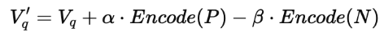

# Objectives

vision–language models such as CLIP have shown that powerful visual concepts can be learned from large-scale web data and used for zero-shot image retrieval using natural-language queries. These models are highly effective at capturing generic visual semantics (e.g., “a dog on a beach”) without task-specific training, and they form the backbone of many modern computer vision systems. Prior human-in-the-loop approaches further show that user feedback can improve retrieval and recognition performance, but this feedback is often limited to low-bandwidth signals such as clicks or binary relevance labels. Despite their strengths, current models struggle with subjective, user-specific concepts (e.g., “my dog looking guilty”) and are costly to adapt through traditional fine-tuning, which requires many labeled examples, significant compute, and time. Moreover, most interactive vision systems underutilize natural language, failing to leverage rich human explanations that describe why a result is incorrect (e.g., what visual attributes should be emphasized or suppressed). As a result, models remain static and poorly aligned with individual users’ mental models.

In this project, we propose an inference-time, co-adaptive approach that allows users to teach a frozen vision–language model new concepts using natural-language critiques. Rather than updating model weights, we will update the query representation by transforming user feedback into positive and negative semantic directions in the model’s embedding space, enabling immediate re-ranking of results. By building and evaluating an interactive prototype over multiple feedback rounds, students will demonstrate how language-driven query adaptation can personalize vision models efficiently and with minimal resources.

## Tasks

General Notes
Over the next few days, we will implement, run, and analyze experiments to test whether natural-language feedback can adapt a frozen vision–language model to user-defined visual concepts. Our goal is to produce some preliminary empirical results, not a polished model.

TASK 1 — Baseline & Data, Getting Comfortable with CLIP
Fun Demos:

- [Neuronpedia Gemma Scope (steer)](https://www.neuronpedia.org/gemma-scope#steer)
- [Visualizing latent spaces](https://douglasduhaime.com/posts/visualizing-latent-spaces.html)
- [Activation Atlas](https://distill.pub/2019/activation-atlas/)

TASK: Set up and play with: [CLIP docs](https://huggingface.co/docs/transformers/en/model_doc/clip)
Dataset Selection: Curate 100–500 images
Flickr8k: [Kaggle Flickr8k dataset](https://www.kaggle.com/datasets/adityajn105/flickr8k/data)
CelebA: [CelebA dataset](https://mmlab.ie.cuhk.edu.hk/projects/CelebA.html)
Compute and extract CLIP image embeddings
Run baseline text-query retrieval.
Manually label relevance for top-k results (binary or 1–5)
End of TASK 1: Baseline Precision@k + saved top-k images

TASK 2: Experimenting with autoencoders

TO be planned yet.

TASK 3: Language Feedback Loop
Write 2–3 natural-language critiques
Parse each critique into:

Positive attributes (P)
Negative attributes (N)

Update query embedding using:

Re-rank images after each feedback round

TASK 4: Experiments & Results

End of TASK 4: figure/tables + research insights
